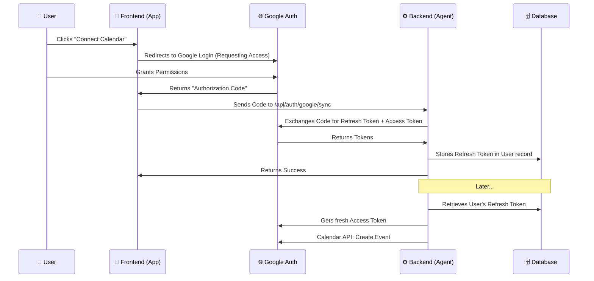

# Multi-User Google Calendar Architecture Plan

Currently, the SalesOps Agent uses a **single global identity** (your `.env` credentials) to manage calendars. To allow each user of your app to connect *their own* Google Calendar, we need to implement a **User-Centric OAuth Flow**.

## The Architecture
We will use the **OAuth 2.0 Authorization Code Flow**. This is the most secure method and allows the backend (Agent) to act on the user's behalf even when they are offline.



## Required Changes

### 1. Database Schema
Update the `User` model in `db/models.py` to store encrypted credentials:
```python
class User(Base):
    __tablename__ = "users"
    id = Column(String, primary_key=True)
    email = Column(String, unique=True)
    # New Fields
    google_refresh_token = Column(String, nullable=True)
    is_calendar_connected = Column(Boolean, default=False)
```

### 2. Backend API Endpoint
Create a new route in `api/auth.py` to handle the code exchange:
- **POST `/api/auth/google/sync`**:
    - Takes `auth_code` from frontend.
    - Uses `google-auth` library to exchange it for a `refresh_token`.
    - Updates the user record in Postgres.

### 3. Agent Tool Update (`mcp_tools/google_calendar.py`)
Modify the functions to be **context-aware**. Instead of reading from `settings.GOOGLE_CALENDAR_REFRESH_TOKEN`, the tool will:
1.  Take the `current_user` object.
2.  Retrieve the `google_refresh_token` from the user's database record.
3.  Proceed with the API call.

### 4. Frontend Integration
In your React Native app:
1.  Integrate a Google Sign-In library (e.g., `react-native-google-signin`).
2.  Configure it to request **server-side access** (`offlineAccess: true`).
3.  Send the resulting `serverAuthCode` to your backend.

## Security Considerations
- **Encryption**: `google_refresh_token` should be encrypted before being saved to the database (using `cryptography` library) to protect user data if the DB is compromised.
- **Scopes**: Only request the minimum required scopes (`calendar.events`, `calendar.freebusy`).

## Why this is better?
1.  **Scalability**: Your app can handle thousands of users, each with their own calendar.
2.  **Privacy**: One user's agent cannot see another user's calendar.
3.  **Persistence**: The `refresh_token` allows the agent to send meeting reminders or update events in the background without the user having to be "online" in the app.
